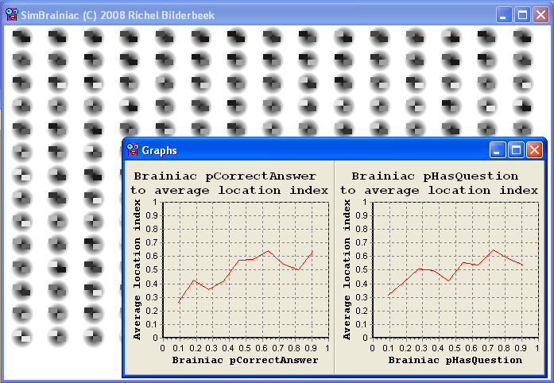

# SimBrainiac

Branch|[](https://travis-ci.org)
---|---
`master`|[](https://travis-ci.org/richelbilderbeek/SimBrainiac)

```
This computerprogram has nothing to do with the TV-program 'Brainiac'
```

SimBrainiac is a simulator of the Brainiac teaching form as used in the 
education of biology and science by Richel Bilderbeek (see below at
'Teaching form').



In SimBrainiac, students are simulated playing Brainiac.
Every simulated student (a 'Brainiac') has:

 * a chance to correctly answer a question
 * a chance to make up a new question

The simulation demonstrates that both parameters are relevant to obtain a higher rank. The chance to correctly answer a question is the most relevant.

SimBrainiac is programmed in C++ using the IDE C++ Builder 6.0. It uses the STL, VCL and Boost libraries.

 * [Download the Windows executable](http://richelbilderbeek.nl/ToolSimBrainiacExe.zip)

## Teaching form

```
This teaching work form has nothing to do with the TV-program 'Brainiac'!
```

The Brainiac teaching work form can be used to prepare students for a test.

The Brainiac teaching form proceeds as follows:
1) Let all students sit side-by-side facing the teacher.
Every student must have a text book
The person at the most right is the Brainiac,
the person at the most left is lowest in rank.

2) All students need to make up questions from the theory

3) If a student has found a question, he/she touches the
shoulder of a student higher in rank. The question is posed.
If the question is not correctly answered, the answer is given
and the students switch places, else they remain seated. If
the students disagree about the question being answered right
or wrong, they also remain seated.

4) A student is only allowed to ask questions as long as not being
asked a question (from the student lower in rank).

I also program a simulation of the Brainiac teaching form, called 'SimBrainiac'. Go to the SimBrainiac page.

### Evaluation

At the 28th of March of 2008, I used the Brainiac teaching form
in one of my VMBO third-year classes.

I measured the level of fun and the level of learning by counting fingers.

Level of fun:

 * Very boring : 1
 * Boring : 0
 * Neutral : 2
 * Fun : 3
 * Very much fun : 6
 
Level of learning

 * Having learned nothing at all: 0
 * Having learning not that much: 1
 * Learned as much as a lecture : 6
 * Learned more then usual : 5
 * Learned much more then usual : 0
